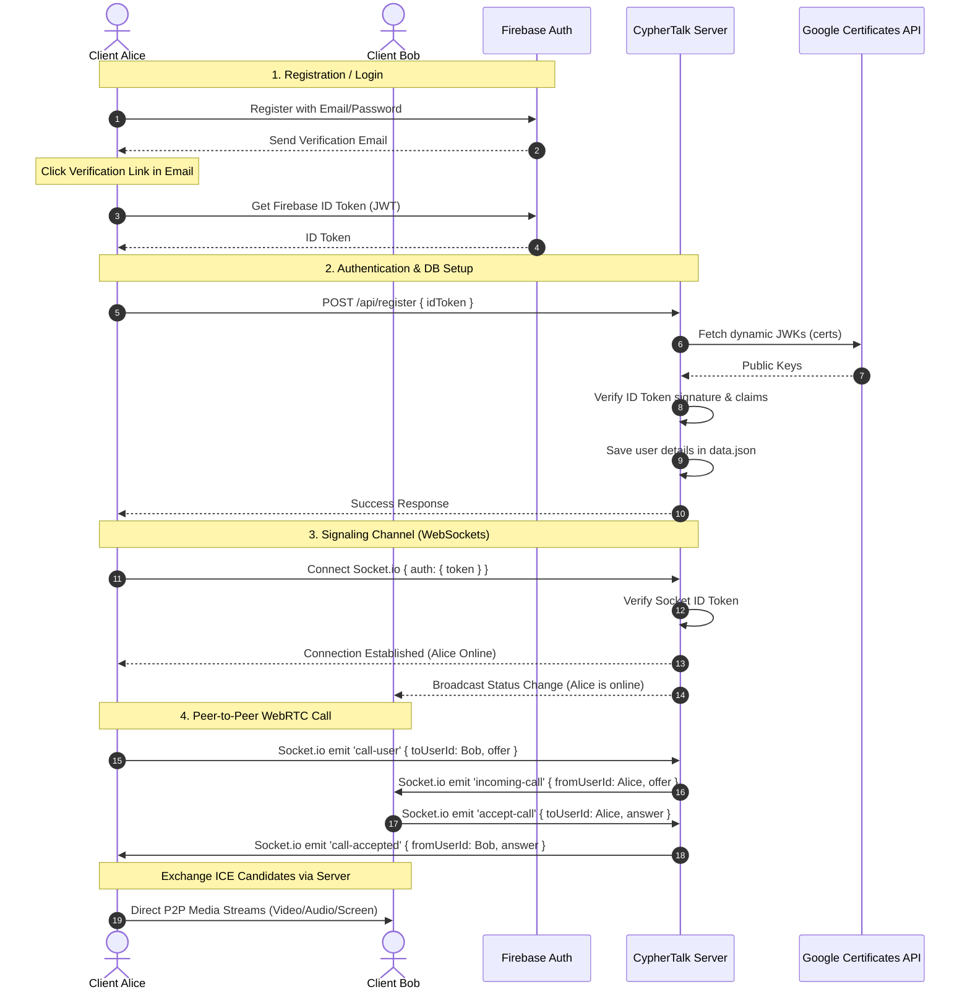

# CypherTalk 🔐

A premium, secure WebRTC-based audio and video calling platform. Styled with a futuristic glassmorphic UI design (**Obsidian Nebula**) and backed by a dynamic Node.js signaling server integrated with **Firebase Authentication**.

---

## 🏗️ System Architecture

CypherTalk utilizes a hybrid architecture: **Firebase Auth** manages client-side authentication and email validation, while a custom **Node.js Express & Socket.io server** orchestrates real-time presence indicators and WebRTC signaling.



---

## 🚀 Features Implemented

*   **Firebase Authentication**:
    *   Secure registration with password strength requirements.
    *   **Email Verification Gate**: Users cannot access the system until they click the link sent to their inbox, preventing spam or fake accounts.
    *   Tokens are periodically auto-refreshed in the background to prevent session timeouts.
*   **Security Token Verification**:
    *   A custom JWT verification engine inside `server.js` dynamically pulls Google's public JSON Web Key (JWK) certificates and caches them based on `Cache-Control` headers.
    *   Every API request and Socket.io handshake is verified against this token to check signatures, expiry, and the `cyphertalk-195d6` audience.
*   **Direct & Contact Dialing**:
    *   Users can dial contacts by clicking on online friends in their contacts list.
    *   **Direct Secure Dial**: Paste any user's unique Secure ID directly into the main panel input and call them instantly without adding them as a friend.
*   **Offline/Error Safety Gates**:
    *   If you dial a contact who is offline or doesn't exist, the server instantly returns a rejection code, alerting the client and returning the channel to the idle state immediately.
*   **Media Controllers**:
    *   Toggles for mute/unmute audio, hide/show camera, and native screen sharing.
*   **Keep-Alive Ping Endpoint**:
    *   Exposes `GET /api/ping` to allow free uptime pinging services (e.g. UptimeRobot) to keep the app active 24/7 on free-tier cloud servers (like Render/Railway).
*   **Environment Secret Isolation**:
    *   All Firebase credentials are loaded dynamically from [`.env`](file:///c:/Users/KISHO/Documents/New%20OpenCode%20Project/.env) (which is ignored by Git for security) and served to the client via `/api/firebase-config` on load.

---

## 🛠️ Technical Stack

*   **Backend**: Node.js, Express, Socket.io, JSON Database, JsonWebToken.
*   **Frontend**: HTML5, Vanilla JavaScript (ES Modules), Tailwind CSS, Material Symbols, QRCode.js.

---

## 🏁 Running the App locally

### 1. Prerequisites
Ensure you have [Node.js](https://nodejs.org) installed on your machine.

### 2. Configure Environment Variables
Create a [`.env`](file:///c:/Users/KISHO/Documents/New%20OpenCode%20Project/.env) file in the root directory and add your Firebase credentials:
```ini
JWT_SECRET=your_jwt_signing_secret
FIREBASE_API_KEY=your_firebase_api_key
FIREBASE_AUTH_DOMAIN=your_firebase_auth_domain
FIREBASE_PROJECT_ID=your_firebase_project_id
FIREBASE_STORAGE_BUCKET=your_firebase_storage_bucket
FIREBASE_MESSAGING_SENDER_ID=your_firebase_messaging_sender_id
FIREBASE_APP_ID=your_firebase_app_id
```

### 3. Installation
Install the project dependencies:
```bash
npm install
```

### 4. Running the Server
Start the Express server:
```bash
npm start
```
The application will be accessible at [http://localhost:3000](http://localhost:3000).

---

## 📂 Project Structure

```
├── public/                 # Static web assets
│   ├── index.html          # Secure calling dashboard (Obsidian Nebula)
│   ├── login.html          # Tabbed access & registration portal
│   └── dashboard.html      # Redirection logic
├── data.json               # Local database (gitignored)
├── server.js               # Express & Socket.io server
├── test_signaling.js       # Signaling test script
├── package.json            # Node.js project configuration
└── .gitignore              # Ignored file patterns
```
